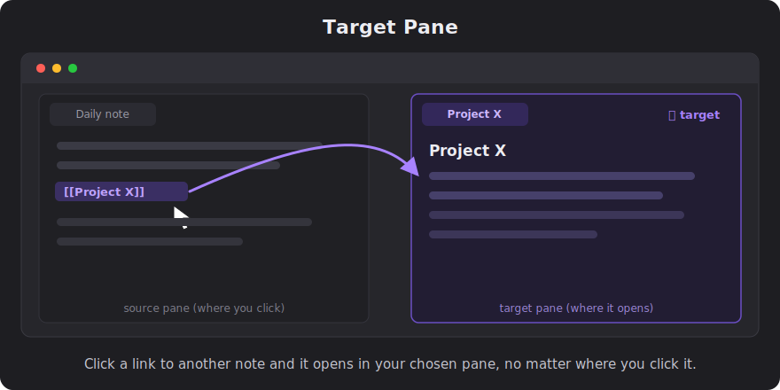

# Target Pane

> Pick a pane. Every **note link** you click — including the link icon on an **embedded note** — opens *there*, no matter which pane you clicked it from.



**Target Pane** lets you designate one pane (tab group) as the destination for **note links** (links that take you to a *different* note). Once set, clicking a `[[wikilink]]` to another note, a Markdown link, or the link icon on an `![[embedded note]]` opens it in your chosen pane instead of hijacking the pane you're reading in. Great for a "read on the left, open references on the right" workflow.

**In-page links** (`#heading` / `^block` jumps within the current note) stay where you clicked, and **web/URL links** are left completely alone.

<!--
  TIP: a short screen-recorded GIF makes the best hero image for a community plugin.
  Capture: two panes, click a link in the left → it opens in the right; then Cmd-click → new tab
  in the right. On macOS, Cmd-Shift-5 records the screen; convert the .mov to .gif (e.g. with
  gifski or an online converter) and drop it in docs/, then replace the SVG above with it.
-->


---

## Features

- **Set any pane as the target** with a single command; clear it just as easily.
- **All note links route to the target** — reading view, Live Preview, and embedded-note link icons.
- **Click vs. Cmd/Ctrl-click are distinct:**
  - **Click** → opens in the target pane's **currently active tab** (replaces it).
  - **Cmd/Ctrl-click** → opens as a **new tab** in the target pane.
  - **Cmd/Ctrl-Alt-click** (split) and "open in new window" are left to Obsidian's natural behavior.
- **In-page links stay put** — `#heading` and `^block` jumps scroll within the pane you clicked; they don't go to the target.
- **Web/URL links are untouched** — external links open in your browser exactly as usual.
- **Status-bar indicator** shows whether targeting is on or off.
- **Survives restarts** — your target pane is remembered across reloads and Obsidian restarts.
- **Auto-off** — if you close the target pane entirely, targeting turns itself off.

## How it works

| You do… | …it goes to |
| --- | --- |
| Click a **note link** (to another note) | Target pane → active tab (replaced) |
| Cmd/Ctrl-click a **note link** | Target pane → new tab |
| Cmd/Ctrl-Alt-click a note link | Obsidian default (split) |
| Click an **in-page link** (`#heading` / `^block`) | Stays in the pane you clicked |
| Click a **web/URL link** | Opens in your browser (unaffected) |
| Target turned off | Stock Obsidian behavior |

## Usage

1. Open the pane you want links to land in, and focus it.
2. Run **Target Pane: Set target pane to the active pane** (Command Palette — `Cmd/Ctrl-P`).
3. The status bar shows **🎯 Target pane: on**. Click note links anywhere — they open in that pane.
4. Run **Target Pane: Clear target pane** to turn it off.

### Commands

| Command | Description |
| --- | --- |
| `Set target pane to the active pane` | Make the focused pane the target. |
| `Clear target pane` | Turn targeting off. |

## Installation

### From Community Plugins (once published)

1. **Settings → Community plugins → Browse**.
2. Search for **Target Pane**, install, and enable.

### Manually

1. Download `main.js`, `manifest.json`, and `styles.css` from the [latest release][releases].
2. Copy them into `<your-vault>/.obsidian/plugins/target-pane/`.
3. Reload Obsidian and enable **Target Pane** under **Settings → Community plugins**.

### Beta (via BRAT)

Install the [BRAT][brat] plugin, then add `mjsharkey/obsidian_target_pane` as a beta plugin.

## Notes & known behavior

- **Pinned tabs:** when targeting is **off**, clicking an in-page (`#heading` / `^block`) link inside a *pinned* tab can make Obsidian open it in another pane. That's native Obsidian behavior (a pinned tab refuses navigation), not this plugin.
- Cmd/Ctrl-Alt-click (split) and new-window opens are intentionally left alone for now, so you keep full manual control when you want it.

## Development

Requires Node.js and npm.

```bash
git clone https://github.com/mjsharkey/obsidian_target_pane.git
cd obsidian_target_pane
npm install
npm run dev      # esbuild watch — rebuilds main.js on save
```

To test in a real vault, symlink this repo into a vault's plugins folder and use the
[Hot-Reload][hotreload] plugin (it auto-reloads on `main.js` changes because this repo has a
`.git` directory):

```bash
ln -s "$(pwd)" "/path/to/your/vault/.obsidian/plugins/target-pane"
```

Then enable both **Target Pane** and **Hot Reload** in the vault. For a production build:

```bash
npm run build    # type-checks, then emits a minified main.js
```

### Releasing (maintainer)

Releases are automated. Write notes in `release-notes/<version>.md`, then:

```bash
./scripts/release.sh patch    # or minor / major / an explicit X.Y.Z
```

`release.sh` bumps `package.json` / `manifest.json` / `versions.json`, commits, pushes, and pushes a version **tag**. Pushing a tag matching `[0-9]+.[0-9]+.[0-9]+` triggers [`.github/workflows/release.yml`](.github/workflows/release.yml), which runs `npm ci`, builds, attaches `main.js` / `manifest.json` / `styles.css` to a new GitHub release, and signs them with [build-provenance attestations](https://docs.github.com/actions/security-guides/using-artifact-attestations-to-establish-provenance-for-builds). Branch / work-in-progress pushes never trigger a release — only a version tag does.

## Contributing

Contributions are very welcome — this started as a focused scratch-my-own-itch plugin, and
it'll get better with more eyes and use cases.

- 🐛 **Found a bug?** [Open an issue][issues] with steps to reproduce.
- 💡 **Have a feature idea?** [Open an issue][issues] and describe the workflow you want (e.g. how Cmd-Alt-click or new windows should behave). Real use cases drive the roadmap.
- 🔧 **Want to hack on it?** Fork the repo, make your change on a branch, and open a pull request. Small, focused PRs are easiest to review. Please run `npm run build` first so it type-checks.

No contribution is too small — docs, typo fixes, and edge-case reports all help.

## License

[MIT](LICENSE) © Michael Sharkey

[releases]: https://github.com/mjsharkey/obsidian_target_pane/releases
[issues]: https://github.com/mjsharkey/obsidian_target_pane/issues
[brat]: https://github.com/TfTHacker/obsidian42-brat
[hotreload]: https://github.com/pjeby/hot-reload
